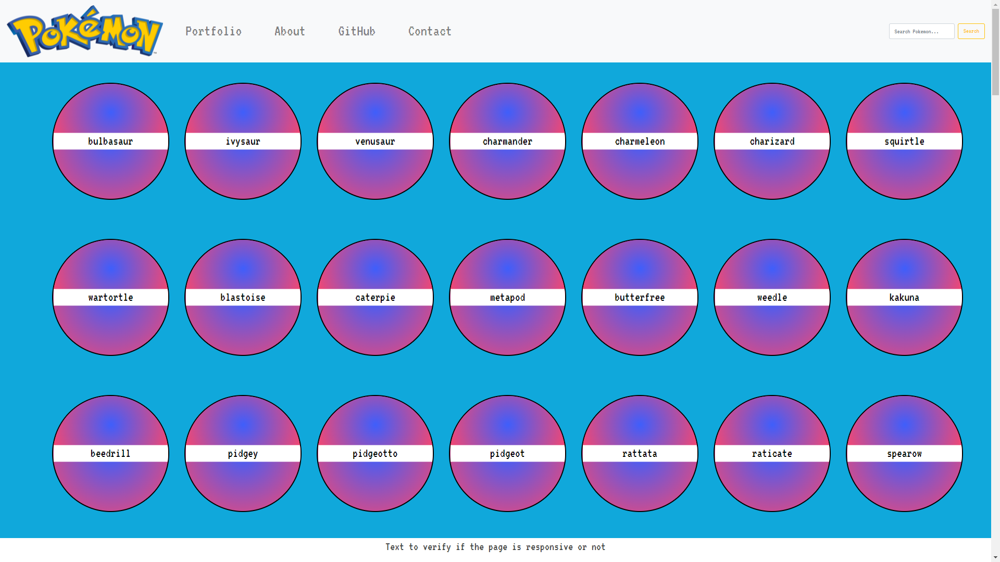

# Pokedex

 

- Load a list of data from an external source (API)
- View a list of hundreds of items
- Details available by clicking on each Pokemon
 
## Live version
[Link](https://cicciotazza.github.io/Pokemon-02/)

## Languages used
- HTML
- CSS
- Javascript

## Creator
-  [Github](https://github.com/cicciotazza)
- Linkedin (to be filled)

### The Requirments:
1. The app load data from external API
1. The app demonstrate the list of the 150 Pokemon
1. The app shows the details of each Pokemon feature
1. The app have a styling CSS feature
1. The JS follow the ESLint rules for fixing errors
1. The app uses one UI pattern like Modal 
1. The app should not show any errors
1. The app will be public in the GitHub deploying
1. The app works in Chrome, Firefox, Safari and Edge

**Task01**
*Basic JS, objects, array, functions, DOM*
**Task02**
*Create a new variable called pokemonList*
*Assign it a blank array*
*Add at least these three keys: name - height - types*
*Save, commit, push*
[x]

**Task03**
*compare pokemoonList*
*write name(height: x)*
*write the tallest: Wow that's big*
*style a bit with CSS*
*make it usable on Mobile*
[x]

**Task04**
a) *forEach() function to be used instead of the for loop*
b) *wrap pokemonList arrain in a IIFE, create a new PokemonRepository, return the function using getAll and add a single item to the pokemonList*
[x]

**Task05**
  *Iterate over the PokemonList array to print out the details*
  *IIFE and getAll*
  *forEach loop*
  [x]

  **Task06**
  *Check the ProjectBrief*
  *create a button for each Pokemon in the array*
  *run console.log for each Pokemon obkect passed as parameter*
  *add event listener*

  **Task07**
  *Promises*
  *polyfills*
  *console.log returns details on click*
  [x]

   **Task08**
  *Modal and interaction*
  [x]

  **Task10**
  *Bootstrap utilities*
  *Dependency*
  *Navbar with links and toggle*
  [x]

  **Task11**
  *Debug*
  *ELint*
  *Prettier*
  *Minify*
  [x]

### Pokemons list used
- [Pokedex](https://www.pokemon.com/us/pokedex/)
- [API list](https://pokeapi.co/api/v2/pokemon)